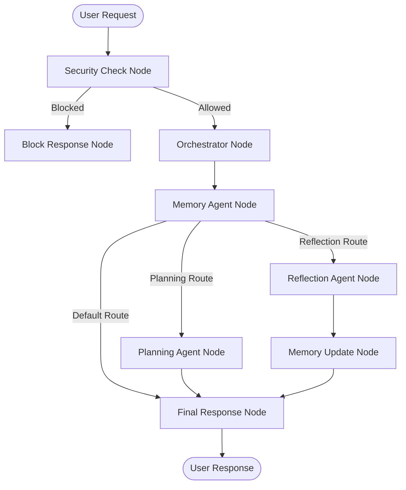

# NovaOS — AI Personal Operating System
### Kaggle 5-Day AI Agents Capstone Submission Write-up

**Live Hosted Dashboard:** [https://nova-os-4ugp.onrender.com/static/index.html?t=12345](https://nova-os-4ugp.onrender.com/static/index.html?t=12345)
**Live Hosted Dev UI / Playground:** [https://nova-os-4ugp.onrender.com/dev-ui/](https://nova-os-4ugp.onrender.com/dev-ui/)

---

## 1. Problem Statement

People struggle to achieve long-term personal goals (like studying a new skill, training for an event, or developing a health habit) because of a lack of consistent planning, structural breakdown, progress visibility, and feedback loops. Conversational AI assistants helper tools can draft lists, but they have no long-term persistence, cannot adapt schedules based on real completion rates, and do not provide an integrated workflow for daily planning and reflections. 

NovaOS addresses this by providing a persistent, cognitive personal operating system that continuously translates high-level aspirations into milestones, schedules daily tasks, logs progress, and refines future schedules using custom feedback.

---

## 2. Solution Architecture

NovaOS is built using a secure multi-agent workflow graph. Below is the orchestration pipeline:

---

## 3. Concepts & Framework Capabilities Used

* **Google ADK 2.0 Workflow Graph API:**
  - Implemented in [agent.py](file:///c:/Users/VEDANT/Projects/NovaOS/nova-os/app/agent.py) to declare nodes (such as `security_check`, `orchestrator`, `planning_agent`) and connect them explicitly using the `Workflow` and `Edge` classes.
  - Using programmatic execution of sub-agents via `await ctx.run_node(agent, node_input=...)` within FunctionNodes to safely compose prompts and handle database contexts.

* **LlmAgent Sub-Agents:**
  - Declared modularly in their respective agent directories:
    - [Orchestrator Agent](file:///c:/Users/VEDANT/Projects/NovaOS/nova-os/app/agents/orchestrator/agent.py)
    - [Memory Agent](file:///c:/Users/VEDANT/Projects/NovaOS/nova-os/app/agents/memory/agent.py)
    - [Planning Agent](file:///c:/Users/VEDANT/Projects/NovaOS/nova-os/app/agents/planning/agent.py)
    - [Reflection Agent](file:///c:/Users/VEDANT/Projects/NovaOS/nova-os/app/agents/reflection/agent.py)

* **MCP Server Integration:**
  - Designed a single MCP server in [mcp_server.py](file:///c:/Users/VEDANT/Projects/NovaOS/nova-os/app/mcp_server.py) using the MCP Python SDK.
  - Wrapped tools (like `save_goal`, `create_task`, `save_reflection`, etc.) inside the MCP server.
  - Wired the `McpToolset` into the `planning_agent` and `reflection_agent` in their respective files to enable secure, standard communication between the sub-agents and the database.

* **Security Checkpoint:**
  - Implemented inside [app/agents/security/agent.py](file:///c:/Users/VEDANT/Projects/NovaOS/nova-os/app/agents/security/agent.py) and wired directly as the entry point of the ADK graph.
  - Prevents prompt injections (filtering keyword attacks) and scrubs PII (emails, phones, SSNs) using regex prior to downstream LLM execution. 
  - Generates a local `security_audit.log` capturing logs of every request.

* **Agents CLI & Dev Server:**
  - Scaffolded using `agents-cli scaffold create`.
  - Configured custom FastAPI endpoint mountings in [fast_api_app.py](file:///c:/Users/VEDANT/Projects/NovaOS/nova-os/app/fast_api_app.py) to serve the static dashboard front-end.

---

## 4. Security Design

NovaOS implements a strict safety envelope at the entry point:
* **PII Redaction:** A regex scrubber matches standard email, phone, and SSN formats. Redacted details are replaced with `[REDACTED_EMAIL]`, `[REDACTED_PHONE]`, and `[REDACTED_SSN]`. This prevents leakage of sensitive personal data to external LLM APIs.
* **Injection Block:** A keyword block blocks malicious attempts (e.g. instruction overrides like "Ignore previous instructions") from reaching the Orchestrator, protecting the model from prompt hijackings.
* **Audit Trail:** Every evaluation gets logged in `security_audit.log` with a timestamp, severity (INFO/WARNING/CRITICAL), and classification details.

---

## 5. MCP Server Design

The Model Context Protocol (MCP) server runs as a separate process communicating over `stdio` and connects to the SQLite database:
1. **Goal Management:** Exposes `save_goal`, `get_goal`, `update_goal` to create and update status.
2. **Task Management:** Exposes `create_task`, `complete_task`, `get_today_tasks` to structure daily study or habit actions.
3. **Memory Management:** Exposes `save_memory`, `search_memory` for user settings, profile variables, and preferences context.
4. **Reflection Management:** Exposes `save_reflection`, `get_reflections` for daily performance analyses.

---

## 6. Human-in-the-Loop (HITL) Flow

A personal OS is by definition collaborative. Humans remain in the loop at key interaction points:
1. **Goal Approvals:** Users input their aspirations, but the system presents a plan for approval. Users can modify instructions or select another template.
2. **Task Check-offs:** Users check off their tasks on the dashboard, which writes updates back to the SQLite store and triggers re-evaluations by the Reflection Agent.
3. **Daily Reflection Logs:** Users input comments about how they felt, what blocked them, or what went well, which feeds the next planning cycle.

---

## 7. Demo Walkthrough

The capabilities of NovaOS can be verified using three distinct test scenarios:
1. **Initial Goal Formulation:** Create a marathon study or fitness plan. Planning Agent creates milestones and lists tasks.
2. **Safety Check Enforcement:** Input an injection string or phone number to verify that it is scrubbed or blocked.
3. **Reflection logging:** Complete tasks, input a reflection about struggling with certain concepts, and see the AI recommendation adjust to suggest lighter loads or tips.

---

## 8. Impact & Value Statement

NovaOS represents a shift from reactive search chat widgets to proactive personal planners. By organizing multiple specialized agents under a secure ADK workflow, it balances the creativity of generative LLMs with the reliability of a structured SQLite database. Users benefit from long-term memory, consistent scheduling, and automatic reflection loops, making it an ideal companion for learners, creators, and professionals.
